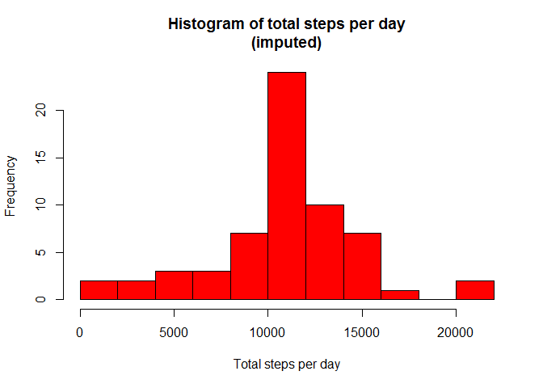

# Reproducible Research: Peer Assessment 1


## Loading and preprocessing the data
The data (as presented in the assignment (see README document), unzipped to a file called "activity.csv") is assumed to be in the working directory. If not, the data can downloaded and unzipped with the following code:


```r
## Download file
url <- "https://d396qusza40orc.cloudfront.net/repdata%2Fdata%2Factivity.zip"
zipfile <- "repdata_data_activity.zip"
if (!file.exists(zipfile)){
    download.file(url, destfile = zipfile)
}

## Unzip
actfile <- "activity.csv"
if (!file.exists(actfile)){
    unzip(zipfile, exdir=".")
}
```
The contents / codebook of the unzipped file ("activity.csv") can be found in the README contained in this repository as well.

To read the file into R, the following code is used, resulting data frame is called "activity":

```r
activity <- read.csv(actfile, header = TRUE, stringsAsFactors = FALSE)
```

As can be read in the README, the data contains NA's, but these wil be dealt with later on (or not at all). No further preprocessing of the data seems necessary at the moment.

Packages that will be used in the analysis are dplyr and lattice. So install these first (if not installed already).

```r
if (!require("dplyr")){
    install.packages("dplyr")
}
library(dplyr)
if (!require("lattice")){
    install.packages("lattice")
}
library(lattice)
```

## What is mean total number of steps taken per day?

The first step is to calculate the total number of steps per day, ignoring missing values:

```r
StepsPerDay <- activity %>%
    filter(complete.cases(activity)) %>%
    select(steps, date) %>%
    group_by(date) %>%
    summarise(TotalSteps = sum(steps, na.rm = TRUE))
```
Then, a histogram is made, showing the frequency occurance per number of steps.

```r
hist(StepsPerDay$TotalSteps,
     main = "Histogram of total steps per day",
     xlab = "Total steps per day",
     col = "red",
     breaks = 10)
```

<!-- -->

Breaks have been set to 10, to make the plot a little more granular.

Finally, the mean and median of the total numer of steps per day can be calculated:

```r
mean(StepsPerDay$TotalSteps)
```

```
## [1] 10766.19
```

```r
median(StepsPerDay$TotalSteps)
```

```
## [1] 10765
```
That the mean total numer of steps taken per day equals 10,766.19. The median is just a little lower (10,765).

## What is the average daily activity pattern?

To examine the average daily activity pattern, first the average number of steps per time interval is calculated.

```r
StepsPerInterval <- activity %>%
    filter(!is.na(steps)) %>%
    select(steps, interval) %>%
    group_by(interval) %>%
    summarise(AverageSteps = mean(steps, na.rm = TRUE))
```

In a time series plot, this looks like:

```r
plot(StepsPerInterval$interval, StepsPerInterval$AverageSteps,
     type = "l",
     col = "blue",
     main = "Time series of average number of steps per interval",
     xlab = "Time interval",
     ylab = "Average number of steps per interval")
```

<!-- -->

There seems to be a peak in activity around time interval 8:00 AM. The 5-minute time interval which contains the maximum numer of steps can be found from the R-code below:

```r
StepsPerInterval[[which.max(StepsPerInterval$AverageSteps),1]]
```

```
## [1] 835
```

So the most steps are taken between 8:35 and 8:40 AM.

## Imputing missing values

As mentioned in the section "Loading and preprocessing the data", the data contains missing values. The number of missing values is 2,304. This number can be verified using the following R code:

```r
nrow(activity) - sum(complete.cases(activity))
```

To investigate the effect of missing values, the data has been imputed. The missing values have been replaced with the mean of the 5-minute interval across all (other) days. The code to perform this imputing is shown here:

```r
activity2 <- activity %>%
    group_by(interval) %>%
    mutate( steps = ifelse(is.na(steps), mean(steps, na.rm = TRUE), steps) ) %>%
    ungroup
```

So, "activity2" equals the original data frame "activity", with the replacement of missing values in a 5-minute interval in "steps" by the mean of the non-missing values of the same 5-minute intervals from other days. Another (minor) difference between "activity2" and "activity" is, that the class of "steps" has changed from "int" to "num".

Making a summary of the total number of steps per day (like for he first question):


```r
StepsPerDay2 <- activity2 %>%
    select(steps, date) %>%
    group_by(date) %>%
    summarise(TotalSteps = sum(steps, na.rm = TRUE))
```

And a histogram showing the frequency occurance per number of steps is made (see below).

```r
hist(StepsPerDay2$TotalSteps,
     main = "Histogram of total steps per day\n(imputed)",
     xlab = "Total steps per day",
     col = "red",
     breaks = 10)
```

<!-- -->

Comparing this histogram with the histogram from the first question, the difference is in the the bar with total number of steps per day of 10,000-12,000.

Again, like for the first question, the mean and median of the total number of steps per day are calculated:

```r
mean(StepsPerDay2$TotalSteps)
```

```
## [1] 10766.19
```

```r
median(StepsPerDay2$TotalSteps)
```

```
## [1] 10766.19
```

The mean has not changed, but the median equals the mean now.

## Are there differences in activity patterns between weekdays and weekends?

To investigate if there are different patterns between weekdays and weekends, first a factor variable ("workweek") is created and stored (together with the original data) in a new data frame "activity3".
The variable "workweek" will equal "weekend" if the date is on Sunday or Saturday and "weekday" otherwise.


```r
activity3 <- activity %>%
    mutate(workweek = factor(as.POSIXlt(date)$wday)) %>%
    mutate(workweek = ifelse(workweek %in% c(0,6), "weekend", "weekday"))
```

To create a plot comparing the activity patterns between the two kind of days, first a summary has to be made (comparable to the summary for the second question):


```r
StepsPerInterval3 <- activity3 %>%
    filter(!is.na(steps)) %>%
    select(steps, interval,workweek) %>%
    group_by(workweek, interval) %>%
    summarise(AverageSteps = mean(steps, na.rm = TRUE))
```

A plot comparing the activity patterns between weekends and weekdays can be made (with the lattice package) using the code below.


```r
xyplot(AverageSteps ~ interval | workweek,
       data = StepsPerInterval3,
       type = "l",
       main = "Average number of steps per interval\nsplit by type of day",
       xlab = "Interval",
       ylab = "Number of steps",
       layout = c(1, 2))
```

<!-- -->

This shows that the peak in activity in between 8:35 and 8:40 AM that was found as answer to the second question, is from weekdays.
